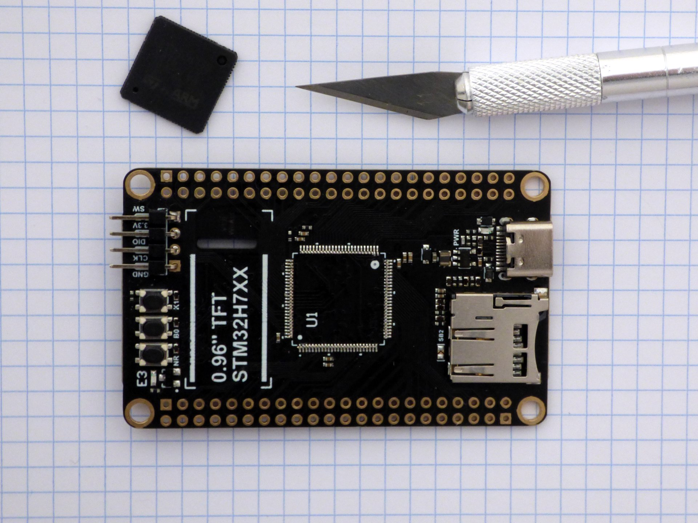
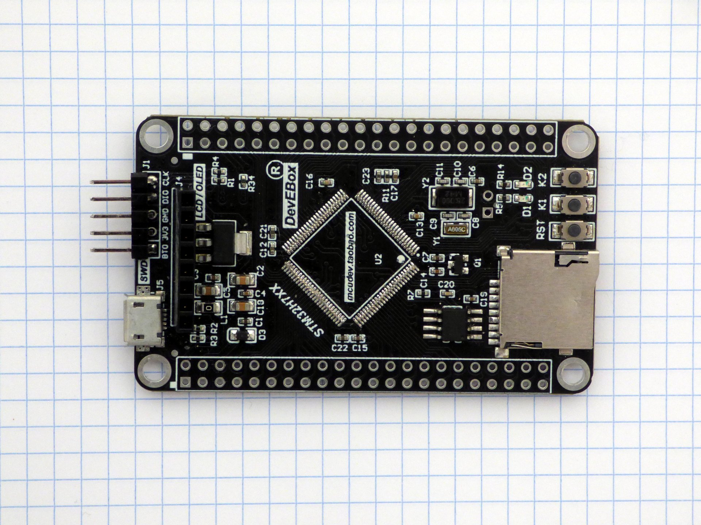
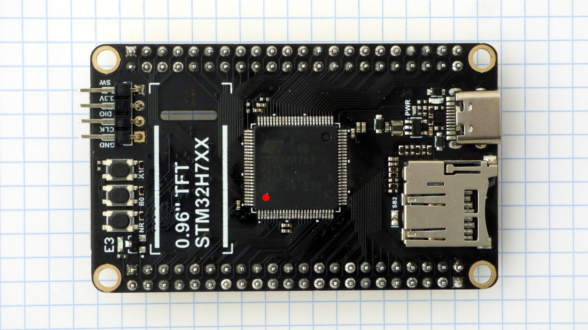
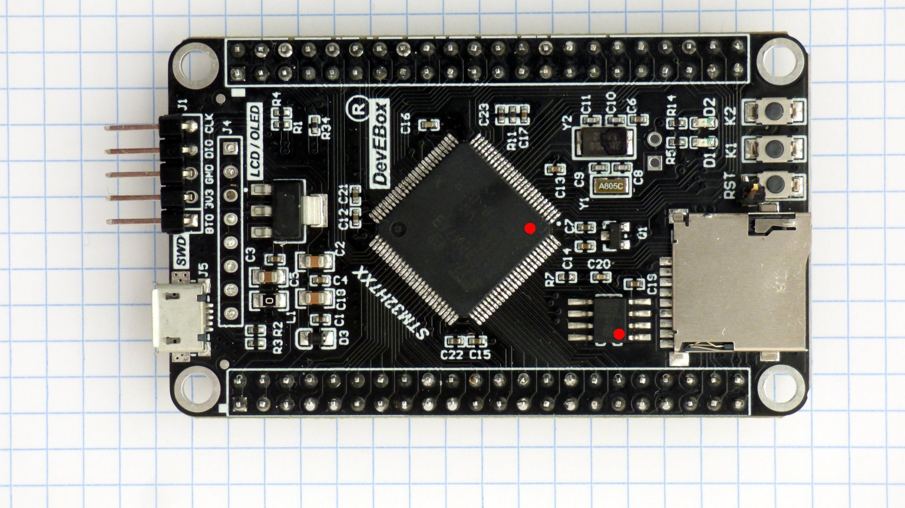
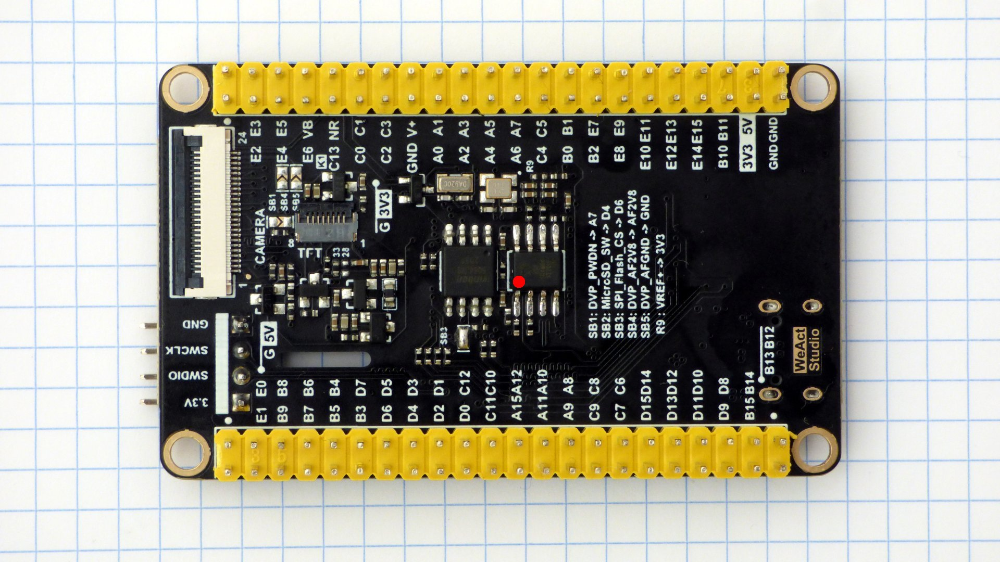
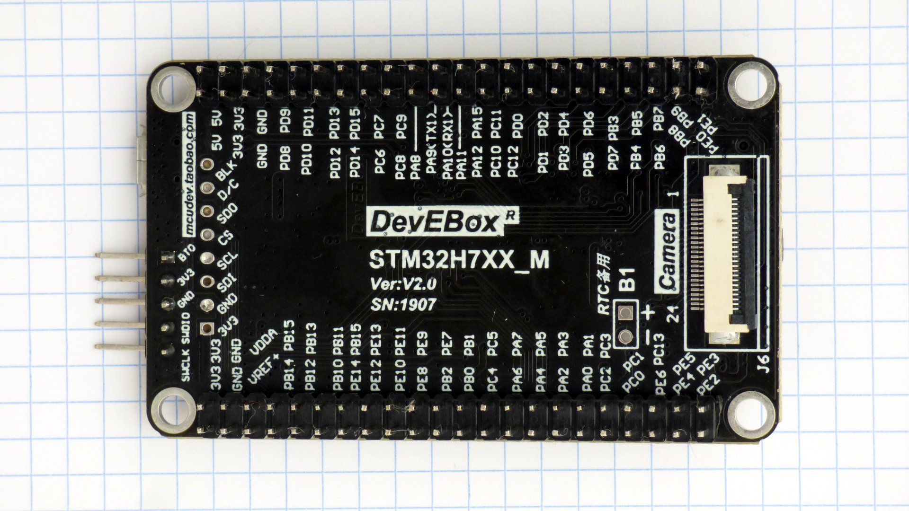

# micropython-spiram

This is a project to add 8 mbyte ram to a stm32h7 micropython board, without changing the pcb.

Steps:

- take an stm32h7 board
- replace the spi flash with a pin-compatible esp-psram64h spi ram
- replace the stm32h750 processor with a pin-compatible stm32h7a3. The stm32h7a3 supports memory mapping spi ram and flash; the stm32h750 only supports memory-mapping flash.
- port micropython to the stm32h7a3
- add driver for spi ram
- compile openmv (Open Machine Vision) for the stm32h7a3


*This is work in progress. I'll document each step as I do it.*

## Take an STM32H7 board

I'm using two different boards:

- DEVEBOX STM32H7XX
- WeAct MiniSTM32H7xx

These are "Made in Asia" boards in the 15-20$ price range, with a STM32H750VBT6 processor. spi flash is used to store firmware and data. These boards are roughly similar to the [OpenMV H7](https://openmv.io/collections/products/products/openmv-cam-h7), have connectors for camera and lcd, and run openmv (Open Machine Vision) software.

## Replace SPI flash

Replace the Winbond W25Q64JVSSIQ 8 mbyte SPI flash memory with a Espressif ESP-PSRAM64H 8 mbyte SPI pseudo-static RAM.

These two ic's are pin compatible. The ESP-PSRAM64H spi ram is 150 mil wide while the W25Q64 spi flash is 208 mil wide, but you can solder both in the same footprint. 

Lyontek LY68L6400SLIT and Espressif ESP-PSRAM64H seem to be different names for the same chip.

## Replace STM32H7 processor

These boards use a STM32H750VBT6 processor in a LQFP100 package. Replace the STM32H750VBT6 with a STM32H7A3VIT6. 

The sophisticated way to unsolder is with [Chip Quik](http://www.chipquik.com/store/index.php?cPath=200) or [Fast Chip](https://sra-solder.com/fast-chip-kit-for-quik-smd-removal) solder removal alloy. I do it the unsophisticated way: take a scalpel and cut through the pins, then unsolder the pins one by one. Put kapton tape on the parts of the board you do not wish to solder. 

### Before

| WeAct | mcudev |
|--- | ---|
| [](doc/weact_01.jpg) | [](doc/mcudev_01.jpg) |


### After

| WeAct | mcudev |
|--- | ---|
| [](doc/weact_04.jpg) | [](doc/mcudev_04.jpg) |
| [](doc/weact_05.jpg) | [](doc/mcudev_05.jpg) |

Pictures of the boards. The modified chips are marked with a red dot on pin 1.

## First Power Up

Check the processor responds when connecting a debugger to the SWD port. The debugger needs SWDIO, SWCLK, and NRST. On the WeAct MiniSTM32H7xx the NRST pin is on the DuPont connector. On the DEVEBOX STM32H7XX you need to solder a pin to the RST button contacts.

Connect usb, and boot in dfu mode. Check `dfu-util -l` sees device:
```
 $ dfu-util -l
dfu-util 0.9

Found DFU: [0483:df11] ver=0200, devnum=10, cfg=1, intf=0, path="1-1.1", alt=2, name="@OTP Memory   /0x08FFF000/01*1024 e", serial="376E356F3339"
Found DFU: [0483:df11] ver=0200, devnum=10, cfg=1, intf=0, path="1-1.1", alt=1, name="@Option Bytes   /0x5200201C/01*297 e", serial="376E356F3339"
Found DFU: [0483:df11] ver=0200, devnum=10, cfg=1, intf=0, path="1-1.1", alt=0, name="@Internal Flash   /0x08000000/256*08Kg", serial="376E356F3339"

```
The line marked "Internal Flash" is the information we need to modify the micropython mboot bootloader.

## Port Micropython

*Work in progress*


## Considerations

- Up to 4 spi flash or ram memories can be conencted to the STM32H7A3VIT6.

- The board has is a trace from processor SPI pin to the SPI memory ic, and from processor SPI pin to the board DuPont connectors. At low speeds this is not a problem, but at high speeds the trace to the DuPont connector will cause reflections.

- The STM32H7A3VIT6 is pin-compatible with STM32H750VBT6, so you do not have to modify the pcb. For new designs you might consider the STM32H7A3VIT6Q. The difference between STM32H7A3VIT6 and STM32H7A3VIT6Q is that the STM32H7A3VIT6Q has built in switching power supplies. 

## Links
### WeAct-TC/MiniSTM32H7xx

- [github](https://github.com/WeActTC/MiniSTM32H7xx)
- [gitee](https://gitee.com/WeAct-TC/MiniSTM32H7xx)
- [taobao](https://shop118454188.world.taobao.com/
)
- [aliexpress](https://www.aliexpress.com/store/910567080)

### DEVEBOX STM32H7XX

- [github](https://github.com/mcauser/MCUDEV_DEVEBOX_H7XX_M)
- [taobao](https://mcudev.world.taobao.com/)
- [aliexpress](https://www.aliexpress.com/item/4000300005466.html)

*not truncated*


