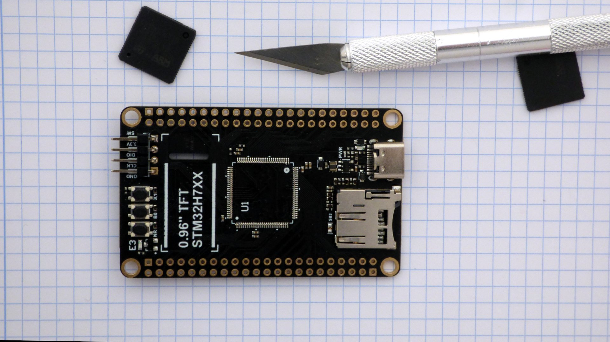

# micropython-spiram

This is a project to add megabytes of ram to a stm32h7 micropython board, without changing the pcb.

Steps:

- take an stm32h7 board
- replace the spi flash with pin-compatible spi ram
- replace the stm32h750 processor with a pin-compatible stm32h7a3. The stm32h7a3 supports memory mapping spi ram and flash; the stm32h750 only supports memory-mapping flash.
- port micropython to the stm32h7a3
- add spi ram driver
- compile openmv (Open Machine Vision) for the stm32h7a3


*This is work in progress. I'll document each step as I do it.*

## Take an STM32H7 board

I'm using two different boards:

- DEVEBOX STM32H7XX
- WeAct MiniSTM32H7xx

These are "Made in Asia" boards in the 10-20$ price range, with a STM32H750VBT6 processor. spi flash is used to store firmware and data. These boards are roughly similar to the [OpenMV H7](https://openmv.io/collections/products/products/openmv-cam-h7), have connectors for camera and lcd, and run openmv (Open Machine Vision) software.

## Replace SPI flash

Replace the Winbond W25Q64JVSSIQ 8 mbyte SPI flash memory with a Espressif ESP-PSRAM64H 8 mbyte SPI pseudo-static RAM.

These two ic's are pin compatible. The ESP-PSRAM64H spi ram is 150 mil wide while the W25Q64 spi flash is 208 mil wide, but you can solder both in the same footprint. 

Lyontek LY68L6400SLIT, Espressif ESP-PSRAM64H, APMemory APS6404L-3SQN seem to be pin compatible.

## Replace STM32H7 processor

These boards use a STM32H750VBT6 processor in a LQFP100 package. Replace the STM32H750VBT6 with a STM32H7A3VIT6. 

The STM32H7A3VIT6 is pin-compatible with STM32H750VBT6, so you do not have to modify the pcb.

The sophisticated way to unsolder is with [Chip Quik](http://www.chipquik.com/store/index.php?cPath=200) or [Fast Chip](https://sra-solder.com/fast-chip-kit-for-quik-smd-removal) solder removal alloy. I do it the unsophisticated way: take a scalpel and cut through the pins, then unsolder the pins one by one. Put kapton tape on the parts of the board you do not wish to solder. 

### Before

| WeAct | mcudev |
|--- | ---|
| [](doc/weact_01.jpg) | [](doc/mcudev_01.jpg) |


### After

| WeAct | mcudev |
|--- | ---|
| [](doc/weact_04.jpg) | [](doc/mcudev_04.jpg) |
| [](doc/weact_05.jpg) | [](doc/mcudev_05.jpg) |

Pictures of the boards. The modified chips are marked with a red dot on pin 1. A pin has been soldered to the DEVEBOARD STM32H7XX reset button. [More pictures](doc/README.md).

## First Power Up

Check the processor responds when connecting a debugger to the SWD port. The debugger needs SWDIO, SWCLK, and NRST. On the WeAct MiniSTM32H7xx the NRST pin is on the DuPont connector. On the DEVEBOX STM32H7XX you need to solder a pin to the RST button. Configure the debugger to assert RST during attach.

Connect usb, and boot in dfu mode. Check `dfu-util -l` sees device:
```
 $ dfu-util -l
dfu-util 0.9

Found DFU: [0483:df11] ver=0200, devnum=10, cfg=1, intf=0, path="1-1.1", alt=2, name="@OTP Memory   /0x08FFF000/01*1024 e", serial="376E356F3339"
Found DFU: [0483:df11] ver=0200, devnum=10, cfg=1, intf=0, path="1-1.1", alt=1, name="@Option Bytes   /0x5200201C/01*297 e", serial="376E356F3339"
Found DFU: [0483:df11] ver=0200, devnum=10, cfg=1, intf=0, path="1-1.1", alt=0, name="@Internal Flash   /0x08000000/256*08Kg", serial="376E356F3339"

```
Take the dfu-util output marked "Internal Flash", and in the micropython bootloader ``ports/stm32/mboot/main.c`` put :

```
#define FLASH_LAYOUT_STR "@Internal Flash  /0x08000000/256*08Kg" MBOOT_SPIFLASH_LAYOUT MBOOT_SPIFLASH2_LAYOUT
```

## Port Micropython
Main differences between H743 and H7A3:

- clock generation
- 1 USB instead of 2
- 2 ADCs instead of 3
- 2 octo-spi (8 wire spi) instead of 1 quad-spi (4 wire spi)

Download schematics. In STM32CubeMX, start a project with processor and pin connections as on the schematic. Set external crystal frequency and do clock tree generation. Hit generate code.

In ``ports/stm32/boards`` take board support files for DEVEBOX STM32H743. STM32H7A3 has more ram than STM32H743, modify linker script.

The STM32H7A3 processor is not yet supported in micropython. Browse the code generated by STM32CubeMX and modify micropython accordingly. [First patch](stm32h7a3.patch), still rough.

And we have a REPL prompt:

```
MicroPython v1.13-237-g8db488963-dirty on 2020-12-07; DEVEBOX STM32H7XX with STM32H7A3
Type "help()" for more information.
>>> import gc
>>> gc.mem_free()
999584

```

The 1 Mbyte of free memory is the internal memory of the mcu.

* Work in progress *

## SPI ram driver

After configuting ospi for spi ram:

```
spiram eid: 0d 5d 52 a2 64 31 91 31
spiram memtest pass
MicroPython v1.13-257-g4bb072268-dirty on 2021-01-21; DEVEBOX STM32H7XX with STM32H7A3
Type "help()" for more information.
>>> import gc
>>> gc.mem_free()
8196192
>>> a=bytes(8000000)
>>> gc.mem_free()
195712
```

The 8 Mbyte of free memory is the external spi ram memory.

* Work in progress *

## Considerations

- The board has a trace from processor SPI pin to the SPI memory ic, and from processor SPI pin to the board DuPont connectors. At low speeds this is not a problem, but at high speeds the trace to the DuPont connector will cause reflections.

## Links
### WeAct-TC/MiniSTM32H7xx

- [github](https://github.com/WeActTC/MiniSTM32H7xx)
- [gitee](https://gitee.com/WeAct-TC/MiniSTM32H7xx)
- [taobao](https://shop118454188.world.taobao.com/
)
- [aliexpress](https://www.aliexpress.com/store/910567080)

The WeAct git also has code to run STM32H750 from external spi flash.

### DEVEBOX STM32H7XX

- [github](https://github.com/mcauser/MCUDEV_DEVEBOX_H7XX_M)
- [taobao](https://mcudev.world.taobao.com/)
- [aliexpress](https://www.aliexpress.com/item/4000300005466.html)

*not truncated*


