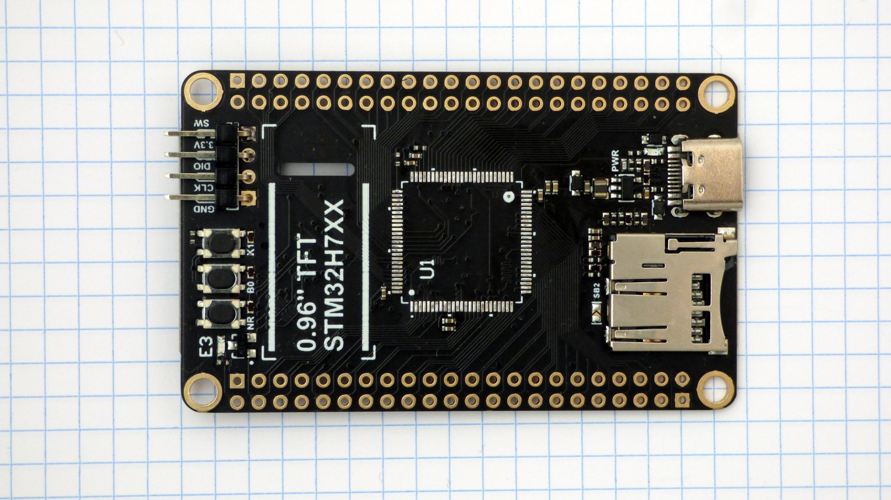
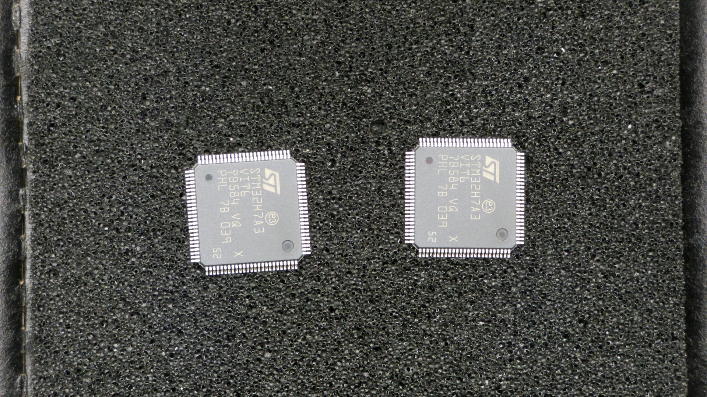
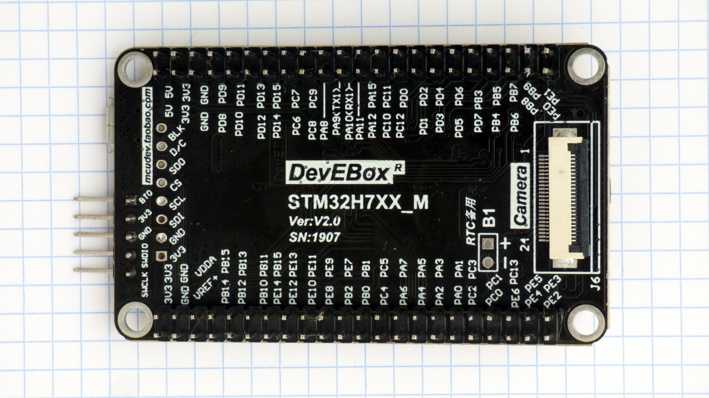

## Rework

| WeAct | mcudev |
|--- | ---|
| Old MCU removed | |
|  |  |
| PCB covered with Kapton tape | |
|  |  |
| Old pins removed, pads cleaned | |
|  |  |
| New MCUs | |
|  | |
| New MCU soldered - front | |
|  |  |
| New MCU soldered - back | |
|  |  |

Changed ICs marked with a red dot on pin 1.